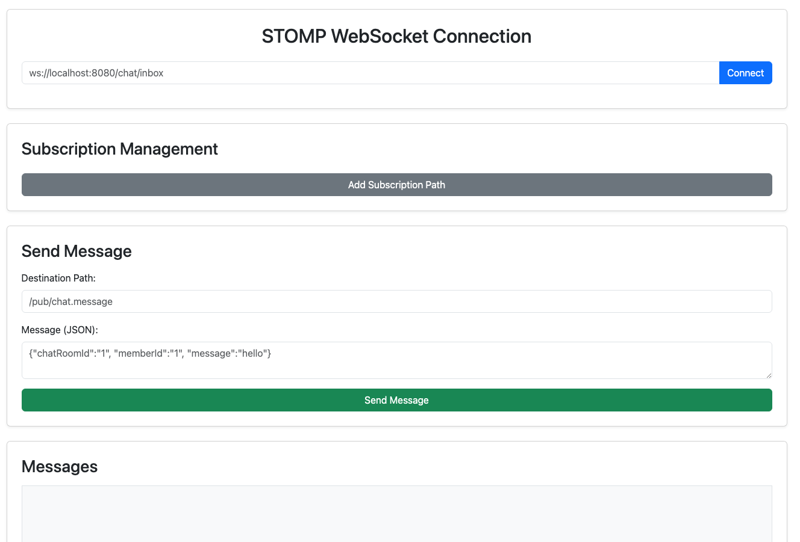

## 설명
이 프로젝트는 Spring + RabbitMQ를 통한 1:1 채팅방을 구현하였다

stomp를 테스트하기 위한 페이지를 지원한다

자세한 설명은 [블로그](https://lsh2613.tistory.com/260)를 참고



## 시작하기
### 1. 도커 rabbitmq 세팅

``` shell
docker pull rabbitmq

docker run -d -p 15672:15672 -p 5672:5672 -p 61613:61613 --name rabbitmq rabbitmq

docker exec rabbitmq rabbitmq-plugins enable rabbitmq_stomp
```

### 2. 채팅 테스트
1. `localhost:8080/init`을 통해 테스트 데이터(채팅방, 유저) 생성
2. `localhost:8080` 페이지로 접속
3. Connect를 통해 WebSocket 연결
4. SUB을 통해 큐 구독
5. Send Message를 통해 특정 큐로 메시지 전송
6. 구독된 큐로 메시지가 발행되면 Message를 출력

> 각 텍스트 에디터에 적힌 placeholder로 진행하면 된다
