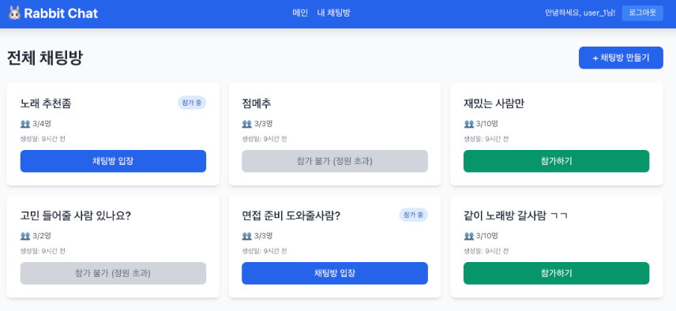
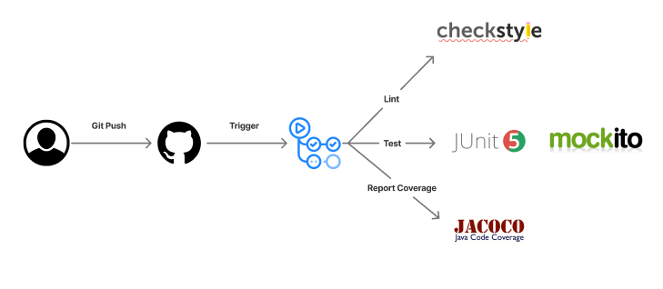
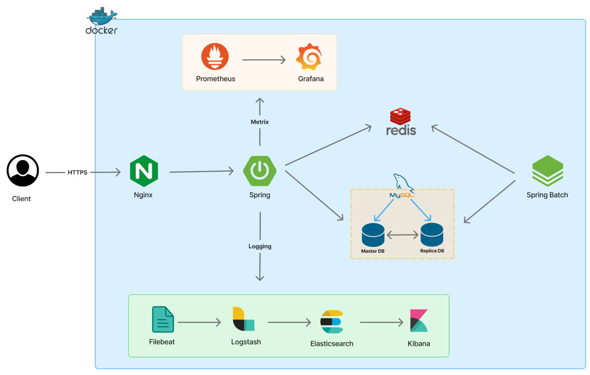
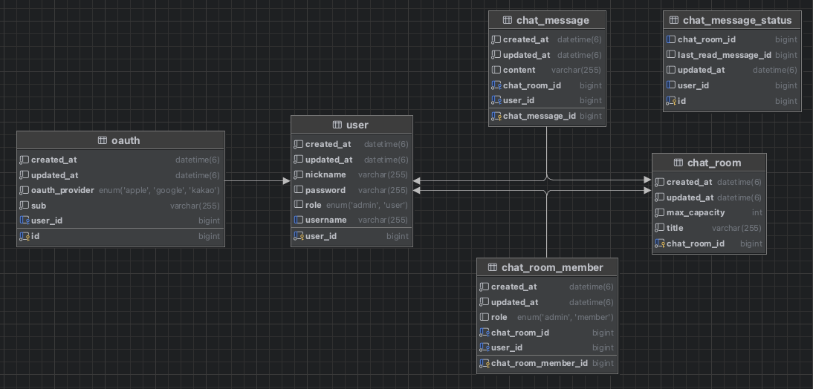

## 🐰 Rabbit Chat
> 채팅 애플리케이션

## 🌳 Branch Convention
> 💡 Custom 전략을 사용합니다.

- `main` : 배포 브랜치
- `dev` : 개발 브랜치
- 이슈 기반 브랜치
  - `feat/*` : 새로운 기능 개발
  - `refactor/*` : 기존 기능 개선
  - `fix/*` : 버그 수정
  - `chore/*` : 기타 작업 (예: 문서 수정, 코드 개선)

## 📌 Architecture
### 1️⃣ System Architecture

### 2️⃣ Infrastructure Architecture

### 3️⃣ ERD

